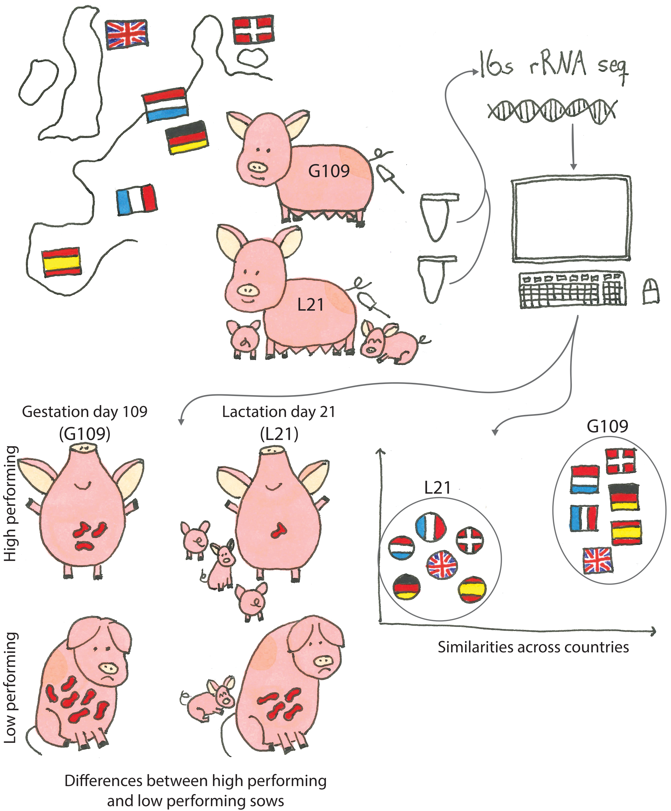

The Following code allows for generation of figures and statistics shown in the article entitled: Identification of Core Microbiomes in European Sows During Gestation and Lactation: Links to Performance. [Article](add link)

In this study fecal samples from sows in 6 European countries were collected on day 109 of gestation and day 21 of lactation. DNA was extracted and 16s rRNA amplicon sequencing was achieved. The analysis showed greater distinction in the microbial composition across time points in the reproductive cycle than across country, and specific species correlated with low performance indicating a needed maturation away from the gestation-associated microbiota composition in order to have high performing sows. 

#### Steps to run 
* if you want to run everything run: [code/run_all.R](code/run_all.R)
* if you just want to run some of it make sure to have run: [code/data_prep.R](code/data_prep.R) to create the phyloseq object used in all the figure/table scripts. 

#### Dependencies:
To be able to run the code the following packages needs to be installed by running [code/install_packages.R](code/install_packages.R):

ANCOMBC 2.6.1        
ape 5.8-1            
BiocManager 1.30.26    
compositions 2.0-8   
devtools 2.4.5      
dplyr 1.1.4        
ggdist 3.3.3         
ggplot2 3.5.2        
ggpubr 0.6.0         
ggVennDiagram 1.5.4
hash 2.2.6.3           
lmerTest 3.1-3       
Maaslin2 1.18.0      
metagenomeSeq 1.46.0  
microViz 0.12.4     
otuSummary 0.1.2    
pairwiseAdonis 0.4.1 
patchwork 1.3.0      
pheatmap 1.0.13       
phyloseq 1.48.0      
qiime2R 0.99.6        
RColorBrewer 1.1-3 
readr 2.1.5          
scales 1.4.0       
stringr 1.5.1       
tibble 3.3.0         
tidyr 1.3.1   
tidyverse 2.0.0     
vegan 2.6-10         
VennDiagram 1.7.3 
